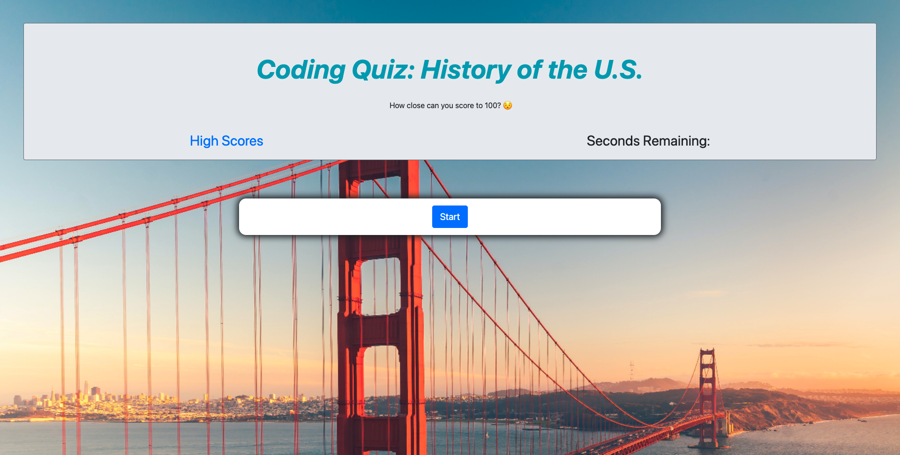

# Code Quiz: US History
  In this application, I have created a quiz with 5 rotating questions with 4 answers to choose from. At the end of the quiz, the user's score is recorded and added to the scores page of the site. 
  
  # Table of Contents  
  ### [Installation](#installation)
  ### [Usage](#usage) 
  ### [License](#license) 
  ### [Contributions](#contributions) 
  ### [Questions](#questions) 
  
  # Installation
  You can run this application by going to: https://itsbrianfire.github.io/code-quiz-us-history/

  
  
  # Usage
  #### This application is best run with the GitHub link used above. Take the quiz to see how close you can stay to 100 without your score dropping any lower! Once you've completed the quiz, enter your initial to mark your score. Check 'High Scores' to see where you rank!

  # License
  ##### MIT

  
  ### https://opensource.org/licenses/MIT
  #####  The MIT License is a permissive free software license originating at the Massachusetts Institute of Technology (MIT) in the late 1980s. As a permissive license, it puts only very limited restriction on reuse and has, therefore, high license compatibility.

  ---
  
  # Contributions
  #### As the developer, I have created this quiz application using javascript APIs, HTML and Bootstrap, as well as CSS to print an interactive frontend for users. This application can be run using the link provided under Installation. 
  
  # Questions
  ### Questions or comments about the project? You can reach me at my GitHub *itsbrianfire* — [GitHub Profile](https://www.github.com/itsbrianfire)
  #### or contact me at brianhgarcia@gmail.com.

  ### Happy Coding!